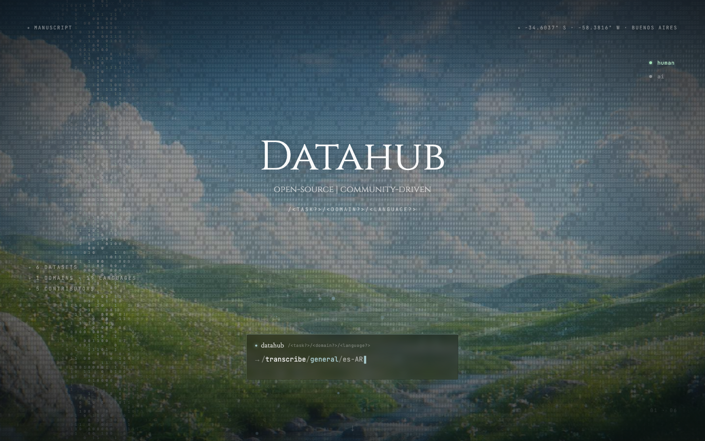

<p align="center">
  
</p>

<p align="center">
  <a href="https://datahub.lat"><code>datahub.lat</code></a>
  &nbsp;·&nbsp;
  <code>::missing data::</code>
</p>

---

an open, community-driven registry of Latin-American datasets.

```
> _ ::missing data::
```

LATAM datasets exist — they sit on HuggingFace, in the Mozilla Foundation,
in the Internet Archive, in Chinese hubs, in the appendix of university
papers. there's no shared index pointing to them. this is the shared index.

→ read the rationale: [`paper.html`](./paper.html) · [`datahub-abstract.md`](./datahub-abstract.md)
→ live: [datahub.lat](https://datahub.lat)

## ontology

three nested levels, walked from general to specific — the way a
practitioner actually searches for data.

| level | what it answers | examples |
| --- | --- | --- |
| **task** | the verb the dataset trains or evaluates | `transcribe` |
| **domain** | the knowledge grouping it sits in | `general`, `medical`, `legal`, `finance` |
| **language** | the language and regional variant | `es-AR`, `es-MX`, `pt-BR`, `qu`, `gn`, `ay` |

current state of the registry (auto-updated by [`scripts/gen-readme.mjs`](./scripts/gen-readme.mjs)):

<!-- BEGIN STATE -->
| axis | declared | touched by a record |
| --- | --- | --- |
| records | 6 | — |
| tasks | 3 | 1 |
| domains | 5 | 1 |
| languages | 28 | 19 |
| organizations | 5 | — |
<!-- END STATE -->

most cells are still `::missing data::`. that's the kickstart state, not
the destination.

European Spanish and European Portuguese are intentionally out of scope:
if a system was built for or evaluated on a LATAM variant, it belongs here.
Missing an indigenous language? Open a PR.

## the data

`data.json` is the source of truth. the shape *is* the ontology — top-level
vocabulary lists declare what's allowed; records reference values from
those lists, or the validator rejects the commit.

```jsonc
{
  // primary navigational axes
  "tasks_supported": ["transcribe"],
  "input_type":      ["audio", "text"],            // medium fed in
  "output_type":     ["text", "audio"],            // medium produced
  "domains":         ["general", "medical", "legal", "finance"],
  "languages":       ["es-AR", "es-BO", "...", "pt-BR", "qu", "gn", "ay",
                      "en", "Multilingual", "N/A"],

  // descriptive attribute vocabularies
  "licenses":        ["CC0", "CC-BY-SA 4.0", "GPL-3.0"],
  "contributing_organizations": [
    { "name": "Mozilla Foundation", "logo": null }
  ],

  "records": [
    {
      "id": 1,
      "task": "transcribe",            // must ∈ tasks_supported
      "input_type": "audio",           // must ∈ input_type
      "output_type": "text",           // must ∈ output_type
      "domain": "general",             // must ∈ domains
      "languages": ["es-AR"],          // every entry must ∈ languages
      "organization": "Universidad Nacional de La Plata",
      "license": "CC-BY-NC-SA 4.0",
      "model": "CordeBA",              // dataset's display name
      "year": 2024,
      "source_url": "https://huggingface.co/datasets/marianbasti/cordeba",
      "description": "Spontaneous-speech corpus of informal conversations…"
    }
  ]
}
```

every record IS a dataset — that's the only kind. add a record whose `task`
is not yet in `tasks_supported` and the validator tells you to add the verb
to the vocabulary first. derived stats (`domains.length`, `languages.length`,
`contributing_organizations.length`) come from the top-level lists, not from
`records` — vocabularies are first-class.

## contribute

the registry grows by pull request.

```sh
node scripts/validate-data.mjs   # green or it doesn't land
```

one-time hook setup so the validator runs on every commit:

```sh
bash scripts/install-hooks.sh
```

the same validator runs as the first step of `build.sh`, so Cloudflare
Pages builds fail loudly on broken data.

paths:

- [tutorial — your first contribution](./docs/tutorial-first-contribution.md)
- [how to add a record](./docs/howto-add-record.md)
- [schema reference](./docs/reference-schema.md)
- [why the schema looks this way](./docs/explanation-design.md)
- [branch + commit conventions](./CONTRIBUTING.md)

## tools

optional skills for contributors using Claude Code. edit
[`scripts/tools-registry.json`](./scripts/tools-registry.json) and run
`node scripts/gen-readme.mjs` (or `bash build.sh`) to regenerate.

<!-- BEGIN TOOLS -->
| skill | what it does | requires | home |
| --- | --- | --- | --- |
| `url-to-dataset-record` | paste a HuggingFace (or other) dataset URL → drafts a validated record matching the registry vocabularies and opens a PR appending it to `data.json`. | Claude Code + the gstack skillpack | maintainer-side tooling — ask for a copy |
<!-- END TOOLS -->

## run locally

```sh
python3 -m http.server 8000
# then open http://localhost:8000/
```

no build step, no `node_modules`, no bundler. React, Babel, and GSAP
load from CDN.

## stack

| file | role |
| --- | --- |
| `index.html` | main shell — React app, scroll choreography, dataset explorer, signal view |
| `hero.jsx` | hero overlay — title, lat/long, stat cluster, terminal |
| `paper.html` | manuscript |
| `Living Layers.html` | animated background — full-bleed iframe |
| `tweaks-panel.jsx` | design-token utilities used by the panel |
| `uploads/hero-bg.png` | background photograph (2048×1153) |
| `data.json` | the registry — top-level vocabularies + records |
| `scripts/validate-data.mjs` | consistency validator (commit + build) |
| `scripts/install-hooks.sh` | one-time `git config core.hooksPath hooks` |
| `scripts/gen-readme.mjs` | regenerate the auto-updated blocks in this README |
| `hooks/pre-commit` | runs the validator before each commit |
| `build.sh` | validate + assemble `dist/` for Cloudflare Pages |

## license & participation

open project. open registry. PRs welcome from anywhere, with a strong
preference for work that increases LATAM visibility.

```
> _ ::missing data::
```
